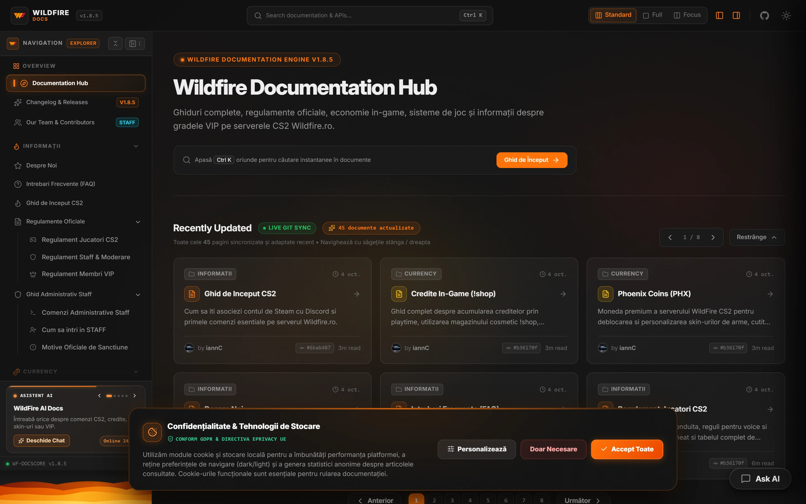
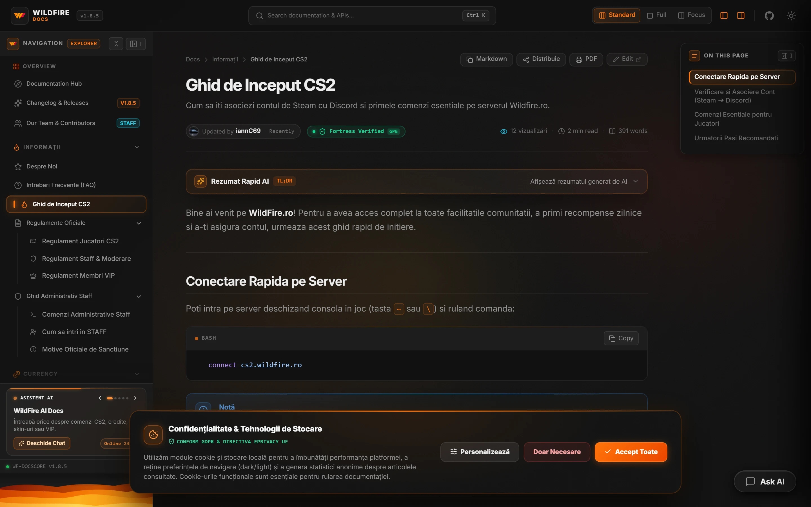
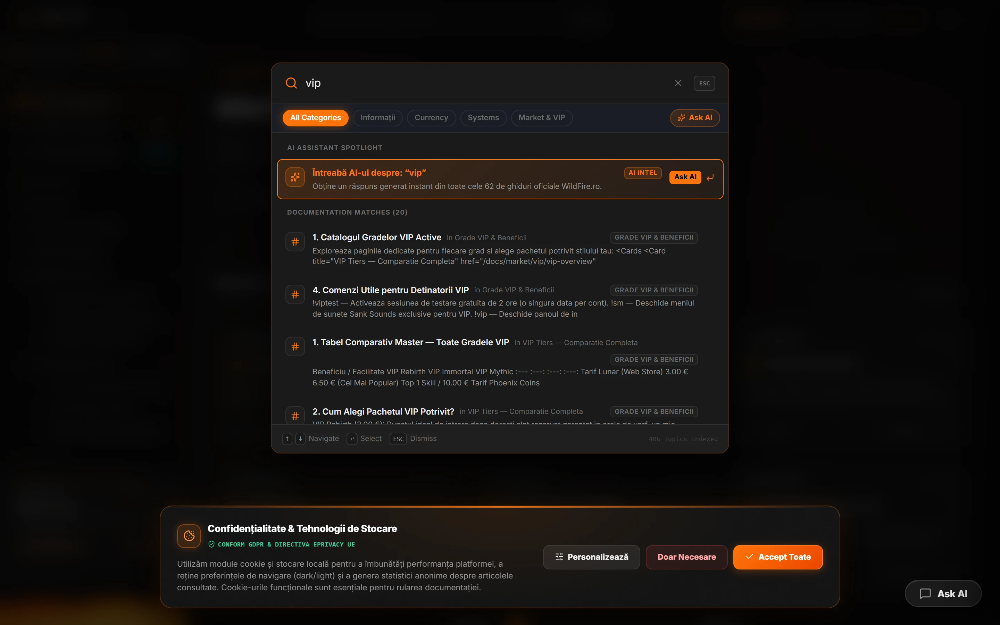
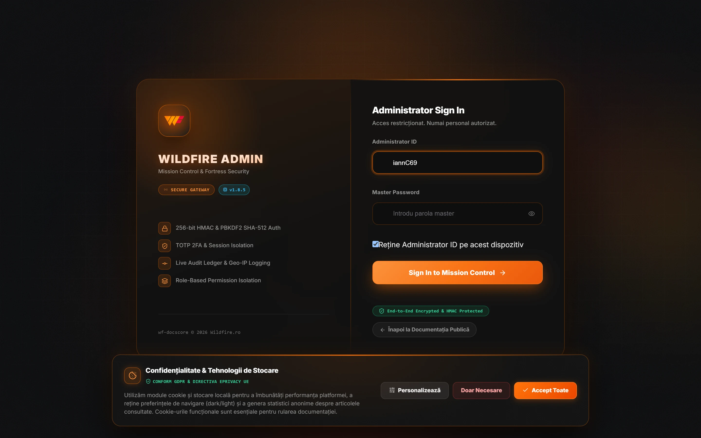
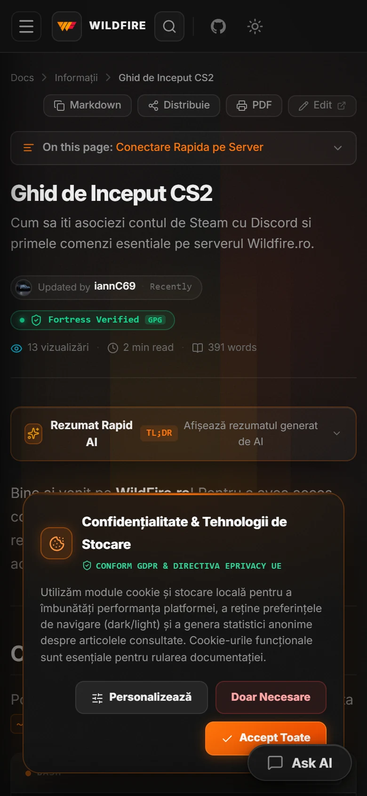

# Wildfire Docs

**Platforma oficială de documentație pentru comunitatea Wildfire CS2**

 

 

[**Accesează Documentația Live →**](https://docs.wildfire.ro)

---

## Despre Wildfire Docs

**Wildfire Docs** este platforma oficială de documentație pentru comunitatea Wildfire, unde jucătorii pot găsi toate informațiile necesare despre serverele, sistemele și economia Wildfire CS2.

Proiectată cu un design modern și o arhitectură performantă bazată pe VitePress, platforma centralizează ghidurile esențiale de joc, cataloagele de comenzi, sistemele economice și regulamentele oficiale, oferind o experiență de navigare rapidă, intuitivă și adaptată oricărui dispozitiv.

---

## Ce Găsești în Documentație

Platforma este organizată modular pentru a reflecta structura reală a serverului și a ecosistemului Wildfire:

### 📖 Informații Generale & Ghiduri
- **Getting Started**: Primii pași pe server, conectarea și asocierea contului de Steam cu Discord (`/verify`), setări inițiale recomandate.
- **Despre Comunitate & FAQ**: Istoricul comunității, ghiduri explicative și răspunsuri detaliate la întrebările frecvente.
- **Regulamente Oficiale**: Norme de conduită pentru jucători, regulamentul echipei Staff și regulamentul dedicat membrilor VIP.
- **Comenzi Administrative**: Catalogul complet de comenzi destinate staff-ului pentru moderarea și buna funcționare a meciurilor.

### 💰 Economie & Valute
- **Sistemul de Credite**: Moneda virtuală a serverului — modalități de câștig pe rundă, pariuri, transferuri între jucători (`!givecredits`) și multiplicatori activi.
- **Phoenix Coins**: Moneda rară a serverului, obținută prin evenimente speciale, loialitate și performanță, utilizabilă în magazinul dedicat.

### 🎮 Sisteme de Joc & Gameplay
- **Skins & Echipamente**: Personalizarea completă a armelor, cuțitelor și mănușilor direct în joc (`!ws`, `!knife`, `!gloves`).
- **Minigocuri & Gambling**: Jocuri interactive integrate pe server — Dices (`!dice`), Ruletă (`!roulette`) și Sloturi (`!slots`).
- **Magazin Cosmetic**: Chat tags personalizate, culori pentru fumuri (Color Smokes), trasee de gloanțe (Tracers) și aure vizuale.
- **Mecanici Specifice**: C4 Planter, efecte de hit, protecție Anti-Rush, votare inteligentă a hărților (Map Chooser) și sistem de misiuni periodice.

### ⭐ Market & Pachete VIP
- **Statuturi VIP**: Prezentarea tier-urilor Immortal, Mythic și Rebirth, cu acces la beneficii specifice, regenerare, tag-uri de chat și rezervare slot.
- **Magazin Premium**: Imnuri MVP customizate, melodii de intrare pe server (Entry Songs) și comenzi audio interactive Sank (`!sank`).

### 👥 Echipă & Changelog
- **Prezentare Echipă**: Profiluri interactive ale dezvoltatorilor și moderatorilor, cu sincronizare GitHub și statistici de implicare.
- **Changelog**: Jurnal transparent de actualizări ce documentează patch-urile, îmbunătățirile și modificările aduse serverelor.

---

## Previzualizare & Galerie

### Pagina de Documentație & Căutare

| Navigare Articole & Conținut | Sistem de Căutare Rapidă (MiniSearch) |
| :---: | :---: |
|  |  |

 

### Panoul Intern de Administrare & Versiunea Mobilă

| Mission Control (Admin Panel) | Experiență Mobile Responsivă |
| :---: | :---: |
|  |  |

---

## Funcționalități Cheie

- **Motor de Căutare Instant**: Indexare rapidă a tuturor secțiunilor prin MiniSearch, cu scurtătură globală (`Ctrl + K`), filtrare pe categorii și evidențierea rezultatelor.
- **Design Adaptiv & Temă Dark**: Interfață întunecată optimizată, cu accente grafice inspirate din identitatea vizuală Wildfire și tranziții fluide fără efect de flicker.
- **Navigație Contextuală**: Structură pe coloane cu sidebar lateral, breadcrumbs dinamice, Table of Contents pe mai multe niveluri și paginare automată (Previous / Next).
- **Elemente Interactive în Conținut**: Casete de evidențiere (Callouts: Note, Tip, Warning), carduri de comenzi, tab-uri interactive și pași secvențiali numerotați.
- **Suport Multi-Limbă**: Integrare Google Translate direct în interfață pentru accesibilitatea jucătorilor internaționali.
- **Metrici & Feedback**: Contorizare anonimă a vizualizărilor per document și sistem de evaluare a utilității ghidurilor.

---

## Panou de Administrare (Admin Panel)

Platforma include un mediu intern dedicat echipei Wildfire pentru gestiunea conținutului și menținerea standardelor documentației:

- **Mission Control**: Panou central cu indicatori de performanță, statistici de citire și sinteză asupra conținutului activ.
- **Content Studio & Linter**: Editor integrat cu validare automată a structurii Markdown, a câmpurilor Frontmatter și a integrității linkurilor interne.
- **Task Hub**: Monitorizarea activităților, a revizuirilor de conținut și a sarcinilor curente ale echipei.
- **Media & Asset Vault**: Arhivare centralizată și optimizare a resurselor grafice utilizate în ghiduri.
- **Search Telemetry & Audit**: Analiza termenilor căutați de comunitate pentru identificarea nevoilor de documentare și jurnal de audit al modificărilor.

---

## Tehnologii

| Tehnologie | Rol în Proiect |
| :--- | :--- |
| **VitePress 2.0** | Generator de site-uri statice ultra-rapid bazat pe Vite |
| **Vue 3.5 & TypeScript** | Componente reactive și arhitectură de tipizare statică |
| **Express 5** | Server dedicat pentru servire și operațiuni administrative |
| **MiniSearch** | Motor de căutare client-side performant |
| **Sharp** | Procesare și comprimare a resurselor grafice în format WebP |
| **Chart.js** | Vizualizarea metricilor și telemetriei în panoul administrativ |

---

## Status Proiect

Wildfire Docs este o platformă activă, sincronizată permanent cu actualizările și noile funcționalități introduse pe serverul de CS2.

- **Domeniu Live**: [https://docs.wildfire.ro](https://docs.wildfire.ro)
- **Comunitate**: [Discord Wildfire](https://discord.gg/wildfire)

---

© **Wildfire.ro** — Toate drepturile rezervate.

